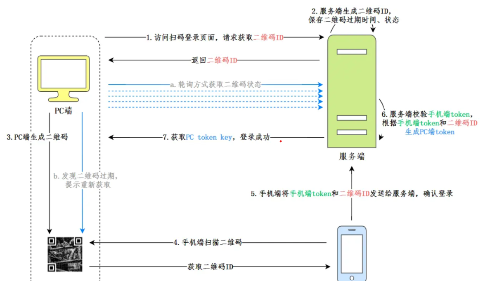

# ivm-controller

## 1. 介绍

**Identity Verification Management （身份验证管理）**

**本项目分为以下几个功能**：

### 1.1  本地密码认证

* 用户信息和密码存储在本地，通过用户名密码进行登录系统

###  1.2 自定义HTTP认证

* 对接第三方认证服务器，可通过传递用户名密码等相关参数到第三方进行认证
* 可自定义请求，包括请求头，请求参数，请求方式
* 可自定义响应，包括响应成功条件，响应字段映射用户信息等

### 1.3 oauth2认证

* 对接标准oauth2认证

### 1.4 本地扫码认证

* 通过已登录移动终端进行扫码认证，实现网页登录

### 1.5 微信和飞书扫码认证

* 微信和飞书扫码认证本质上是oauth2的认证实现
* 通过配置好oauth2认证服务，并将回调地址注册到对应的应用回调地址即可

### 1.6 资源下发

* 这里的资源主要是下发配置的应用，这里的一个个应用其实是配置的应用网站
* 点击对应的应用可跳转到对应的网站
* 可以理解为一个个标签网页，这样做的目的只是写一个简单的demo，后面可对这所谓的资源进行扩展处理

### 1.7 用户同步（暂未实现）

* 由于本人时间原因，具体功能目前暂未实现，相关方案已经设计完毕
* 相关方案在下面，希望其他伙伴可参考一下并进行优化实现

### 1.8 分布式集群（暂未实现）

* 由于本人时间原因，具体功能目前暂未实现，相关方案已经设计完毕
* 相关方案在下面，希望其他伙伴可参考一下并进行优化实现

## 2. 目录结构

```asp
│  go.mod
│  go.sum
│  LICENSE
│  main.go
│  README.md
│
├─config
│      config.ini // 服务器配置信息和数据库配置信息
│
├─controller
│      authServer.go  // 认证服务器相关操作
│      login.go    // 登录相关操作控制层
│      resource.go // 资源相关操作控制层
│      user.go  // 用户相关操作
│      userDirectory.go  // 用户目录
│
├─initEnv    // 初始化环境
│      initDb.go   // 初始化数据库
│      initRedis.go  // 初始化redis
│      loggerInit.go  // 初始化日志工具
│
├─log  // 日志存储，每天一个日志
│      20240813.log
│      20240814.log
│      20240815.log
│      20240816.log
│      20240817.log
│      20240818.log
│      20240819.log
│
├─middleware // 中间件
│      cors.go // 解决跨域
│      isLogin.go // 上线准入中间件，这里可进行扩展，根据用户的环境进行处理，判断是否允许登录
│      recover.go // 处理系统内部panic问题
│
├─model  // 各个model
│      authServer.go
│      resource.go
│      user.go
│      userDirectory.go
│
├─routes // 路由
│      router.go
│
├─service // service层
│      authServer.go
│      resource.go
│      service.go
│      user.go
│
├─test
│      test.go
│
└─utils // 一些通用工具
    │  commonUtil.go
    │  encript.go
    │  jsonUtil.go
    │  request.go
    │  response.go
    │  sessUtil.go
    │  setting.go
    │  sql.go
    │
    └─errmsg
            errmsg.go
```

## 3. 待实现功能方案

### 3.1 用户目录同步

1. 实现一个父结构体，定义相关方法
    * getUser：拉取用户
    * getGroup: 获取组织架构
    * buildUser:创建用户，通过上面两个函数创建系统格式要求的用户
2. pushUser: 定义相关方法，构建完成后，将相关用户push到对应文件里，避免因为用户拉取过多导致内存泄漏 (架构实现)
3. popUser:定义相关方法，从文件里一次读取对应数量的用户记录 （架构实现）
4. importUser: 定义相关方法，将user里面的数据拿出来导入到mirrorUser表里面（架构实现）
5. importTable: 定义相关方法，将mirror表里面的数据导入到数据库里面（架构实现）
6. 整体思路
    * 这里考虑到可能会对接不同的用户目录，子结构体实现父结构体的相关方法getUser，getGroup，buildUser
    * 架构层面同步开启三个协程
        * 第一个协程自己创建，自行拉取用户并构建好系统格式要求的用户类型，push进文件里面
        * 第二个协程是架构已经编写好的协程，不需要自己实现，不断地从第一个协程push进文件地内容，pop对应User记录，并进行importUser
        * 第三个协程是架构已经编写好的协程，同步从mirror表取导入数据库表里面
    * 前端携带同步任务ID进行轮询同步状态，当三个协程全部执行完毕，返回完成状态

### 3.2 分布式集群

1. 实现组建接口

    * 接收其他服务器发送来的组建请求，并进行验证身份，身份通过后认为自己是从节点
    * 然后在该接口中将该从节点的mysql服务注册到主节点的分布式集群里面，并备份当前节点的数据库内容，以主节点的数据库为主数据库
    * 将该从节点的redis服务注册到主节点的redis分布式集群里面，备份当前节点的redis数据，以主节点的redis服务为主redis
    * 并对主节点请求过来的组建时间进行记录

2. 互相实现心跳接口

   如果发现主节点挂掉了并询问其他节点，如果一致认为主节点挂掉了，那么就根据加入的时间谁最先组建的，就认为是主节点

   然后再由组建最早的再次进行组建集群操作，此次再次组建集群不需要备份数据库redis等操作

3. 拆分接口

   实现拆分接口，脱离主节点主节点不需要恢复之前备份状态，由管理员决定是否恢复

4. 恢复接口

   恢复之前的备份数据

## 4. 相关模块实现功能原理

### 4.1 自定义HTTP认证

* 前端传递对应的请求头参数，请求类型等一系列参数对应的值

    * 例如：userName: @uerName
      这样在进行发送请求的时候会根据登录的时候的userName进行替换，然后发送到第三方

* 同时还有一种场景，可能要发多步请求，第一步要获取token，第二步用token才能认为认证成功

    * 例如：在第二步的认证请求中，配置请求keytoken:@token

      那么就会将第一步请求返回的token进行替换，然后再发第二步请求进行替换

### 4.2 本地扫码认证


### 4.3 oauth2认证

标准的oauth2认证，底层用的是项目中封装好的发送请求插件

### 4.4 资源下发

* 用户登录后将关联的资源id放到会话里，前端在获取资源的时候根据资源id，从redis中读取对应的资源并返回
* 新增资源的时候，关联用户，并根据关联的用户进行查找，判断当前用户是否已经登录，如果已经登录则将资源ID放到用户会话里面，同时将资源设置到redis里面
* 当前端再次刷新获取用户资源的时候即可拿到新增的资源，如果没有拿到可根据资源id直接去数据库查找
* 删除同理，删除redis，删除数据库，删除已登录用户里的锁关联的资源id
* 编辑的时候，判断一下资源MD5是否发生变化，如果发生变化则更新redis更新数据库，没有则不更新
* 后台新增定时任务，每天凌晨三点将资源加载到内存中

## 5. 优化点

上述这些功能只能是实现了一个大概，有很多需要优化的点

1. http认证希望能够提供自定义前置脚本和自定义后置脚本功能，可由管理员自行配置

    * 比如在发请求前执行一次前置脚本，对相关定义好的数据进行处理，比如加密，添加相关标记等操作
    * 请求结束后，先对响应的内容进行一次预先处理，比如有些第三方返回的可能是加密的用户名那么在后置脚本就可以进行解密，然后再由框架进行设置

    * 一个想法：用反射或者单独启动一个服务执行这个脚本操作

2. 扫码认证，希望能够支持完全对接第三方服务，因为部分第三方服务扫码，认证，二维码状态都是在第三方，我们需要进行处理

3. 资源下发，项目中只是实现了下发一个url下去，关于资源相关可以有多种可能，比如订单，策略等

4. 还有之前列举的用户同步和分布式集群等功能方案

## 6. 应用

提供多种认证方式，供用户进行身份认证，同时可以扩展该项目实现各种功能，在资源下发还有集群等方面进行实现